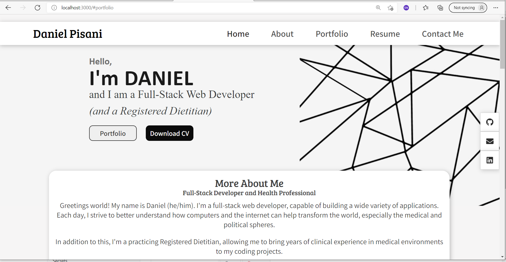

# React Portfolio
## Author: WellAndGood

# Table of Contents
* [Overview](#overview)
* [Appearance](#appearance)
* [Features](#features)
* [Contributors](#contributors)
* [License](#license)

# Overview

This document describes the components of a portfolio created with React.js. This portfolio, as it stands, will not be used for job searches. 

It contains the following components:
- A `<Header>`, which contains a `<Nav>` bar;
- An `<About>` section, which contains important details about the featured coder;
- A `<Project>` section, which contains the coder's portfolio and projects;
- A `<Contact>` section, which contains a form without event handling;
- A `<Footer>` section, which contains links to the coder's social media

# Appearance 

You can access the `.git` files at: 
https://github.com/WellAndGood/ReactPortfolio.git

You can view the website directly here:
https://wellandgood.github.io/ReactPortfolio/

Once loaded, the generated HTML page should look like this:  

This project is intended as a React version of this HTML/CSS portfolio, complete with animate-on-scroll and Tilt libraries, as seen here:
https://github.com/WellAndGood/PureHTMLPortfolio.git   (Repo)
https://wellandgood.github.io/PureHTMLPortfolio/   (Github Page)

## Contributors
Daniel Pisani (WellAndGood)

# Contact
* GitHub account: WellAndGood

## License
This project is licensed under:

### MIT License

Copyright (c) 2021 Daniel Pisani (WellAndGood) 

Permission is hereby granted, free of charge, to any person obtaining a copy of this software and associated documentation files (the "Software"), to deal in the Software without restriction, including without limitation the rights to use, copy, modify, merge, publish, distribute, sublicense, and/or sell copies of the Software, and to permit persons to whom the Software is furnished to do so, subject to the following conditions:

The above copyright notice and this permission notice shall be included in all copies or substantial portions of the Software.

THE SOFTWARE IS PROVIDED "AS IS", WITHOUT WARRANTY OF ANY KIND, EXPRESS OR IMPLIED, INCLUDING BUT NOT LIMITED TO THE WARRANTIES OF MERCHANTABILITY, FITNESS FOR A PARTICULAR PURPOSE AND NONINFRINGEMENT. IN NO EVENT SHALL THE AUTHORS OR COPYRIGHT HOLDERS BE LIABLE FOR ANY CLAIM, DAMAGES OR OTHER LIABILITY, WHETHER IN AN ACTION OF CONTRACT, TORT OR OTHERWISE, ARISING FROM, OUT OF OR IN CONNECTION WITH THE SOFTWARE OR THE USE OR OTHER DEALINGS IN THE SOFTWARE.